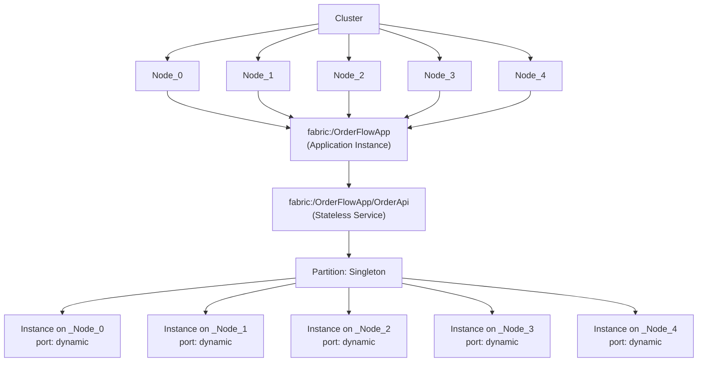
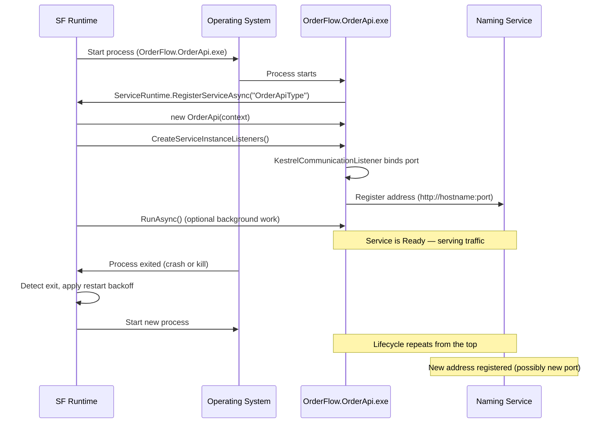
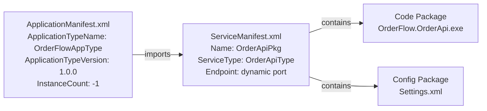
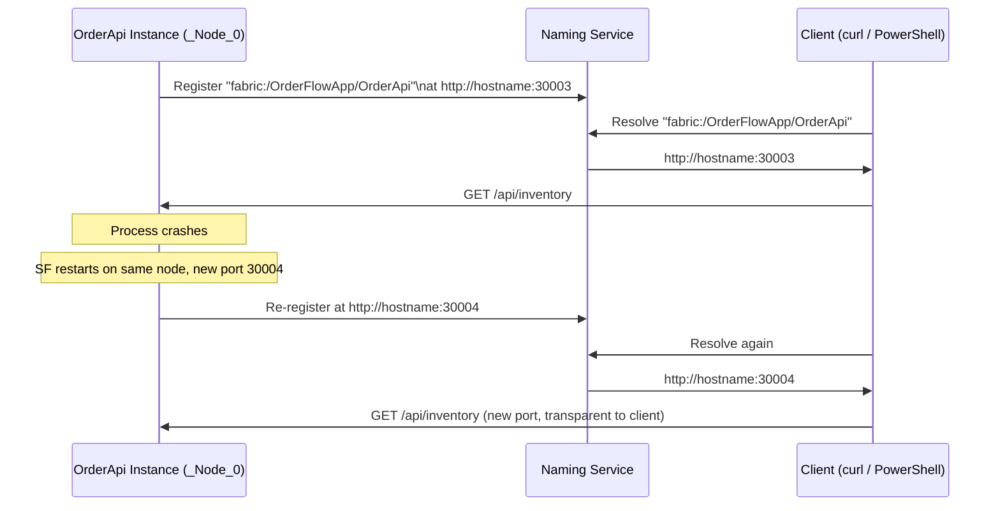
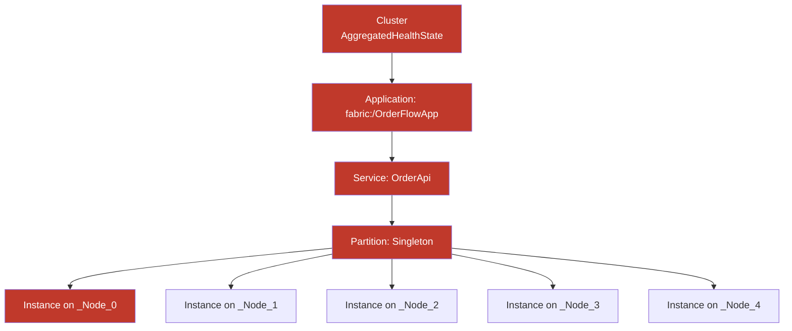
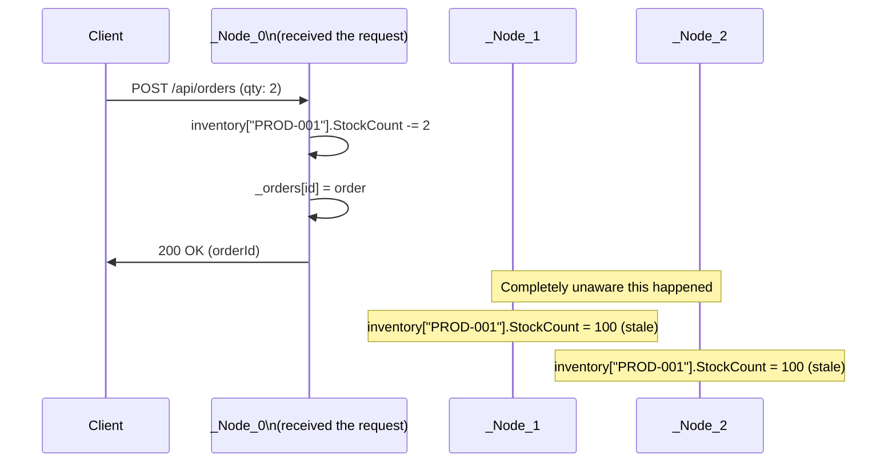
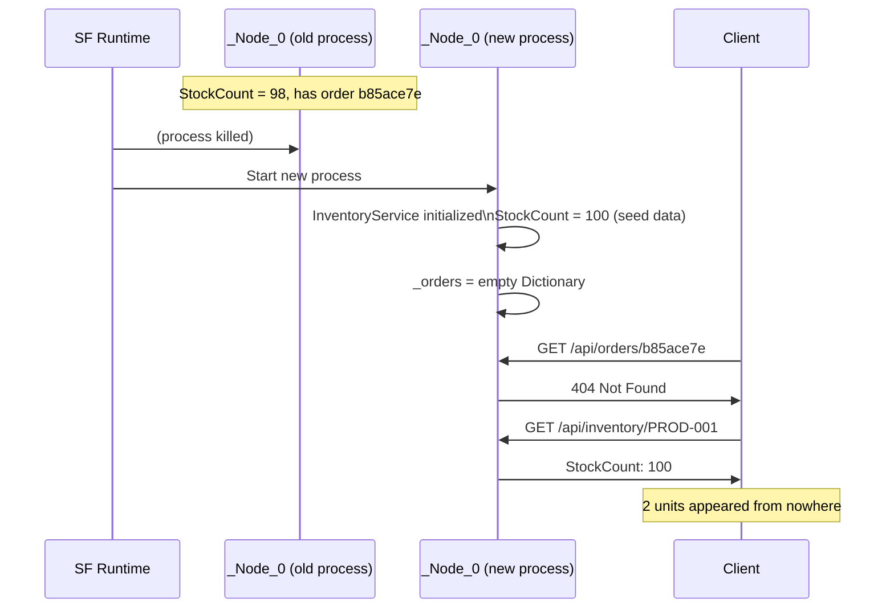

# Phase 01 — Service Fabric: Stateless Service Hosting

## What This Phase Is

Phase 01 takes the OrderFlow monolith from Phase 00 and introduces it to Service Fabric.
The business logic does not change. The services, controllers, and domain models are
identical. What changes is **who owns the process**.

In Phase 00, you ran `dotnet run` and owned everything yourself — startup, shutdown,
restart on crash, port binding. In Phase 01, Service Fabric owns all of that. Your code
registers itself with the SF runtime and implements lifecycle hooks. SF decides when to
start it, where to place it, what port to assign, and what to do when it crashes.

This phase deliberately does **not** solve the state problem. State is still in process
memory. The phase ends by proving — with a live demo — that this causes both data loss
and divergence across nodes. That demonstrated pain is the motivation for Phase 02.

---

## What Changed vs Phase 00

| Concern | Phase 00 Monolith | Phase 01 SF Stateless Service |
|---|---|---|
| Process startup | `dotnet run` / OS | Service Fabric runtime |
| Restart on crash | Nothing | SF detects exit, restarts automatically |
| Port assignment | Hardcoded in `launchSettings.json` | Dynamic — SF assigns from reserved range |
| Service registration | None | Naming Service registers address on start |
| How many copies | 1 | 1 per node (`InstanceCount=-1`) |
| State durability | In-memory, lost on restart | Still in-memory — intentionally unsolved |
| State consistency | Single process | 5 independent copies with diverging state |

---

## Solution Structure

```
Phase01.ServiceFabric/
├── OrderFlowApp/
│   └── ApplicationPackageRoot/
│       ├── ApplicationManifest.xml     # Application type blueprint
│       └── OrderApiPkg/
│           └── Config/
│               └── Settings.xml        # Placeholder — used from Phase 06
│
├── OrderFlow.OrderApi/                 # The SF Stateless Service
│   ├── Controllers/
│   │   ├── InventoryController.cs
│   │   └── OrdersController.cs
│   ├── Services/
│   │   ├── InventoryService.cs         # In-memory — same as Phase 00
│   │   ├── OrderService.cs             # In-memory — same as Phase 00
│   │   └── PaymentService.cs           # Stub — same as Phase 00
│   ├── PackageRoot/
│   │   ├── ServiceManifest.xml         # Service type blueprint (dynamic port)
│   │   └── Config/
│   │       └── Settings.xml
│   ├── OrderApi.cs                     # StatelessService — SF entry point
│   ├── Program.cs                      # ServiceRuntime.RegisterServiceAsync
│   └── ServiceEventSource.cs           # ETW diagnostic boilerplate
│
└── scripts/
    ├── deploy-local.ps1                # Full build/package/deploy via SF REST API
    └── state-loss-demo.ps1             # Proves divergence and data loss
```

---

## Key Concepts Introduced

### The SF Vocabulary



**Cluster** — the set of nodes managed as one environment by the SF runtime.

**Node** — a physical or virtual machine running the SF runtime process.

**Application Type / Instance** — the blueprint (`ApplicationManifest.xml`) vs the
running deployment. Like a class vs an object.

**Service Type / Instance** — the blueprint (`ServiceManifest.xml`) vs the running
copies. For stateless services, each running copy is an **instance**.

**Partition** — a horizontal slice of a service. Stateless services with a
`SingletonPartition` have exactly one partition because there is no state to distribute.

**Instance** — one running copy of a stateless service. With `InstanceCount=-1`,
SF places exactly one instance per node.

---

### The Service Lifecycle



**Why `Program.cs` does not start Kestrel directly:**
SF calls `CreateServiceInstanceListeners()` at the right moment in the lifecycle —
after placement, after port assignment, after any failover move. You must not bind
ports in `Main()` because SF has not assigned a port yet.

---

### The Application Model



**Version numbers matter:** SF uses `ApplicationTypeVersion` and `ServiceManifest Version`
to detect what changed. If you deploy new code without bumping these versions, SF skips
redeployment and your changes never land.

**Dynamic ports:** Removing `Port="8080"` from the `Endpoint` element tells SF to assign
a port from its reserved dynamic range. This is required when running multiple instances
on the same machine (local dev cluster) and is the correct production pattern because
it enables the Naming Service to be the source of truth for addresses.

---

### The Naming Service



The Naming Service is why you can never hardcode ports in Service Fabric.
Services move (failover, rebalancing) and their ports change on restart.
Callers must resolve the current address before each call, or use SF's
built-in reverse proxy (Phase 03).

---

### Health Hierarchy



Health propagates upward. One sick instance turns its partition red, which turns
the service red, which turns the application red, which turns the cluster red.
When debugging in Service Fabric Explorer, follow the red path downward from the
cluster to the specific instance to find the actual error.

---

## The State Problem (Motivation for Phase 02)

### What Happens When You Place an Order



### What Happens When the Process Restarts



### Observed Demo Output

```
── BEFORE ORDER
  _Node_0  Stock: 100
  _Node_1  Stock: 100
  _Node_2  Stock: 100
  _Node_3  Stock: 100
  _Node_4  Stock: 100

── AFTER ORDER (placed through _Node_0)
  _Node_0  Stock: 98   <-- only this node knows
  _Node_1  Stock: 100
  _Node_2  Stock: 100
  _Node_3  Stock: 100
  _Node_4  Stock: 100

  DIVERGENCE: Node_0=98, all others=100
  The cluster has no consistent view of inventory.

── AFTER RESTART
  _Node_0  Stock: 100  <-- new process, seed data, new port
  Order b85ace7e: 404 Not Found
  +2 units appeared from nowhere
```

---

## Checkpoint Questions — Answered

**1. Why does SF use dynamic ports instead of fixed ports in production?**

Because services can be placed on any node and can move between nodes due to failover
or rebalancing. If two instances tried to bind the same fixed port on the same machine
(as happens on a local dev cluster), only one would succeed. Dynamic ports let SF assign
a unique port per instance and register the current address in the Naming Service.
Callers resolve the address at call time rather than knowing it in advance.

**2. What is the difference between an Instance ID and a Node Name?**

The Node Name (`_Node_0`) is the stable identity of the machine. It does not change.
The Instance ID (e.g. `134186207884539948`) is the identity of a specific running
lifetime of a service on that node. Every time the process restarts, SF assigns a new
Instance ID. The Node Name tells you *where* the service is running. The Instance ID
tells you *which run* of the service you are looking at. When correlating logs across
a restart, a gap followed by a new Instance ID means a restart occurred between those
log entries.

**3. Why is the NamingService itself a stateful SF service with multiple replicas?**

Because if the Naming Service went down, no service in the cluster could find any other
service — the entire cluster would be deaf and blind. Making it stateful with replicas
(primary + secondaries) means it survives node failures. Making it partitioned means
the discovery load is distributed. SF managing itself using its own mechanisms is one
of the most elegant aspects of its design.

**4. What does the restart backoff policy prevent?**

It prevents a broken service from consuming all node resources in a tight crash-restart
loop. If a service crashes immediately on startup (e.g. bad config, missing DLL), SF
backs off exponentially before retrying. Without this, a single broken deployment could
spin thousands of processes per minute and starve healthy services of CPU and memory.
The practical symptom is a service stuck in `InBuild` for longer and longer intervals —
the Events tab in Explorer shows the crash reason.

**5. In SFX, how do you find the specific error when a service fails to start?**

Follow the red path downward:
`Cluster → Application → Service → Partition → Instance → Health Evaluations tab`
The leaf-level instance is where the actual stack trace appears. The parent entities
just aggregate and propagate the error upward. The Events tab on the instance shows
the crash timeline.

**6. What is the difference between Deactivate (Restart) and Deactivate (RemoveData)?**

`Deactivate (Restart)` gracefully moves all services off the node and restarts the SF
runtime on it. Services are moved to other nodes first. State on stateful services is
preserved because their replicas on other nodes take over as primary. Used for OS
patching and routine maintenance.

`Deactivate (RemoveData)` simulates permanent data loss on that node — the disk is
treated as gone. SF will not move services back to this node and will place new replicas
elsewhere to restore target replica counts. Used for chaos testing to verify that
stateful services survive permanent node loss without data corruption.

---

## How to Run

### Prerequisites

- Windows 10/11 with SF local cluster running (`http://localhost:19080`)
- .NET 8 SDK
- PowerShell 7+

### Deploy

```powershell
.\src\Phase01.ServiceFabric\scripts\deploy-local.ps1
```

### Find instance addresses

```powershell
$partitionId = (Invoke-RestMethod `
    "http://localhost:19080/Services/OrderFlowApp~OrderApi/$/GetPartitions?api-version=6.0"
).Items[0].PartitionInformation.Id

(Invoke-RestMethod `
    "http://localhost:19080/Services/OrderFlowApp~OrderApi/$/GetPartitions/$partitionId/$/GetReplicas?api-version=6.0"
).Items | ForEach-Object {
    $addr = ($_.Address | ConvertFrom-Json -AsHashTable).Endpoints["HttpEndpoint"]
    [PSCustomObject]@{ Node = $_.NodeName; Address = $addr; State = $_.ReplicaStatus }
} | Format-Table -AutoSize
```

### Test the API (replace PORT with value from above)

```powershell
# Inventory
Invoke-RestMethod http://localhost:PORT/api/inventory | ConvertTo-Json

# Place order
Invoke-RestMethod http://localhost:PORT/api/orders `
    -Method POST -ContentType "application/json" `
    -Body '{"customerId":"CUST-001","productId":"PROD-001","quantity":2}' | ConvertTo-Json
```

### Run the state loss demo

```powershell
.\src\Phase01.ServiceFabric\scripts\state-loss-demo.ps1
```

### Reset the cluster (if things go wrong)

```powershell
& "C:\Program Files\Microsoft SDKs\Service Fabric\ClusterSetup\DevClusterSetup.ps1" -ResetCluster
```

---

## What Phase 02 Solves

Phase 02 introduces `IReliableDictionary` and `StatefulService`. The InventoryService
will be extracted into its own stateful SF service where stock counts are stored in a
Reliable Collection — persisted to a local WAL, replicated to two other nodes, and
transactional. Killing any one process will no longer lose data. All nodes will see the
same inventory because they share replicated state rather than each maintaining their
own independent copy.